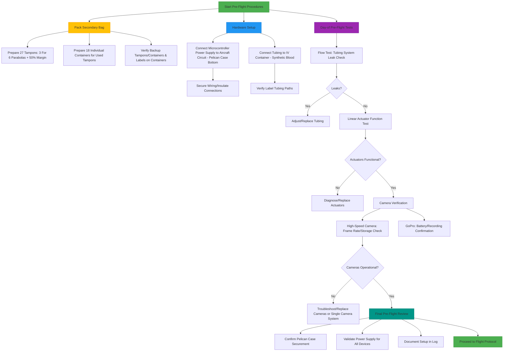
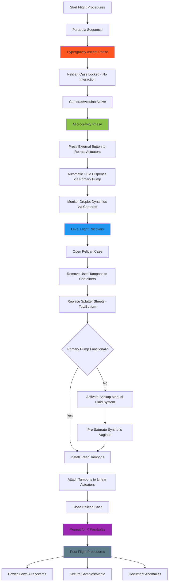
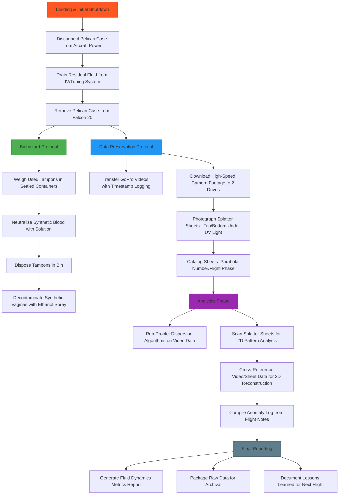

```mermaid
graph TD
    A[Start Pre-Flight Procedures] --> B[Pack Secondary Bag]
    B --> B1[Prepare 27 Tampons: 3 For 6 Parabolas + 50% Margin]
    B --> B2[Prepare 18 Individual Containers for Used Tampons]
    B --> B3[Verify Backup Tampons/Containers & Labels on Containers]
    A --> C[Hardware Setup]
    C --> C1[Connect Microcontroller Power Supply to Aircraft Circuit - Pelican Case Bottom]
    C1 --> C2[Secure Wiring/Insulate Connections]
    C --> C3[Connect Tubing to IV Container - Synthetic Blood]
    C3 --> C4[Verify Label Tubing Paths]
    A --> D[Day-of Pre-Flight Tests]
    D --> D1[Flow Test: Tubing System Leak Check]
    D1 --> D1a{Leaks?}
    D1a -->|Yes| D1b[Adjust/Replace Tubing]
    D1a -->|No| D2[Linear Actuator Function Test]
    D2 --> D2a{Actuators Functional?}
    D2a -->|No| D2b[Diagnose/Replace Actuators]
    D2a -->|Yes| D3[Camera Verification]
    D3 --> D3a[High-Speed Camera: Frame Rate/Storage Check]
    D3 --> D3b[GoPro: Battery/Recording Confirmation]
    D3a --> D3c{Cameras Operational?}
    D3c -->|No| D3d[Troubleshoot/Replace Cameras or Single Camera System]
    D3c -->|Yes| E[Final Pre-Flight Review]
    E --> E1[Confirm Pelican Case Securement]
    E --> E2[Validate Power Supply for All Devices]
    E --> E3[Document Setup in Log]
    E --> F[Proceed to Flight Protocol]
    
    style A fill:#4CAF50,stroke:#388E3C
    style B fill:#FFC107,stroke:#FFA000
    style C fill:#2196F3,stroke:#1976D2
    style D fill:#9C27B0,stroke:#6A1B9A
    style E fill:#009688,stroke:#00796B
    style F fill:#4CAF50,stroke:#388E3C
```

```mermaid
graph TD
    A[Start Flight Procedures]

    A --> C[Parabola Sequence]
    C --> C1[Hypergravity Ascent Phase]
    C1 --> C1a[Pelican Case Locked - No Interaction]
    C1a --> C1b[Cameras/Arduino Active]

    C1b --> C2[Microgravity Phase]
    C2 --> C2a[Press External Button to Retract Actuators]
    C2a --> C2b[Automatic Fluid Dispense via Primary Pump]
    C2b --> C2c[Monitor Droplet Dynamics via Cameras]

    C2c --> C3[Level Flight Recovery]
    C3 --> C3a[Open Pelican Case]
    C3a --> C3b[Remove Used Tampons to Containers]
    C3b --> C3c[Replace Splatter Sheets - Top/Bottom]
    C3c --> C3d{Primary Pump Functional?}
    C3d -->|Yes| C3e[Install Fresh Tampons]
    C3d -->|No| C3g[Activate Backup Manual Fluid System]
    C3g --> C3h[Pre-Saturate Synthetic Vaginas]
    C3h --> C3e[Install Fresh Tampons]
    C3e --> C3i[Attach Tampons to Linear Actuators]
    C3i --> C3j[Close Pelican Case]

    C3j --> C4[Repeat for X Parabolas]
    C4 --> D[Post-Flight Procedures]
    D --> D1[Power Down All Systems]
    D --> D2[Secure Samples/Media]
    D --> D3[Document Anomalies]

    %% Styling for phase clarity
    style C1 fill:#FF5722,stroke:#E64A19 %% Hypergravity
    style C2 fill:#8BC34A,stroke:#689F38 %% Microgravity
    style C3 fill:#2196F3,stroke:#1976D2 %% Level Flight
    style C4 fill:#9C27B0,stroke:#6A1B9A %% Loop
    style D fill:#607D8B,stroke:#455A64 %% Post-Flight
```

```mermaid
graph TD
    A[Landing & Initial Shutdown] --> A1[Disconnect Pelican Case from Aircraft Power]
    A1 --> A2[Drain Residual Fluid from IV/Tubing System]
    A2 --> A3[Remove Pelican Case from Falcon 20]

    A3 --> B[Data Preservation Protocol]
    B --> B1[Download High-Speed Camera Footage to 2 Drives]
    B --> B2[Transfer GoPro Videos with Timestamp Logging]
    B1 --> B3[Photograph Splatter Sheets - Top/Bottom Under UV Light]
    B3 --> B4[Catalog Sheets: Parabola Number/Flight Phase]

    A3 --> C[Biohazard Protocol]
    C --> C1[Weigh Used Tampons in Sealed Containers]
    C1 --> C2[Neutralize Synthetic Blood with Solution]
    C2 --> C3[Dispose Tampons in  Bin]
    C3 --> C4[Decontaminate Synthetic Vaginas with Ethanol Spray]

    B4 --> D[Analytics Phase]
    D --> D1[Run Droplet Dispersion Algorithms on Video Data]
    D --> D2[Scan Splatter Sheets for 2D Pattern Analysis]
    D2 --> D3[Cross-Reference Video/Sheet Data for 3D Reconstruction]
    D3 --> D4[Compile Anomaly Log from Flight Notes]

    D4 --> E[Final Reporting]
    E --> E1[Generate Fluid Dynamics Metrics Report]
    E --> E2[Package Raw Data for Archival]
    E --> E3[Document Lessons Learned for Next Flight]

    style A fill:#FF5722,stroke:#E64A19
    style B fill:#2196F3,stroke:#1976D2
    style C fill:#4CAF50,stroke:#388E3C
    style D fill:#9C27B0,stroke:#6A1B9A
    style E fill:#607D8B,stroke:#455A64
```
